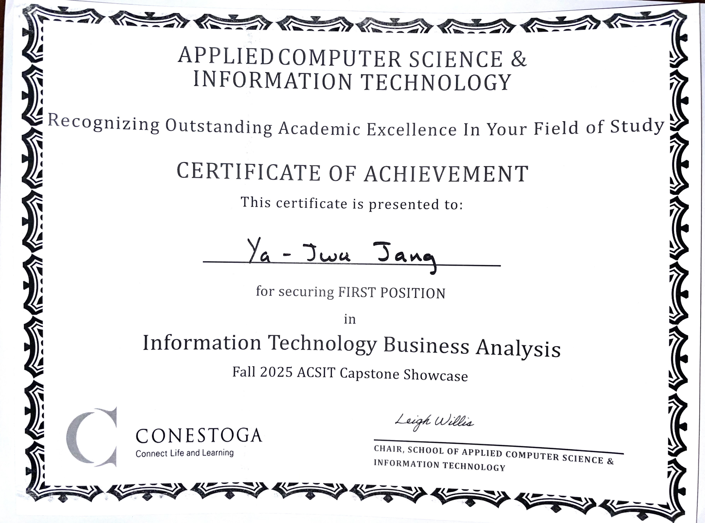
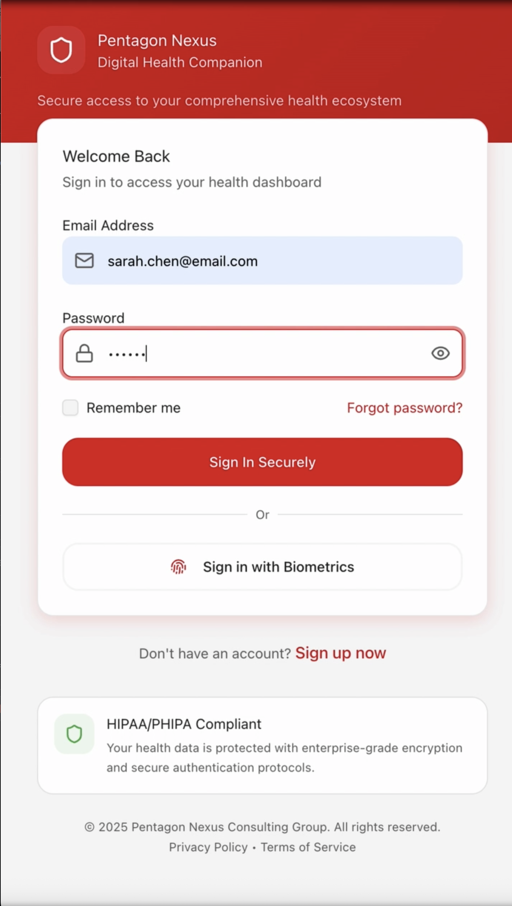
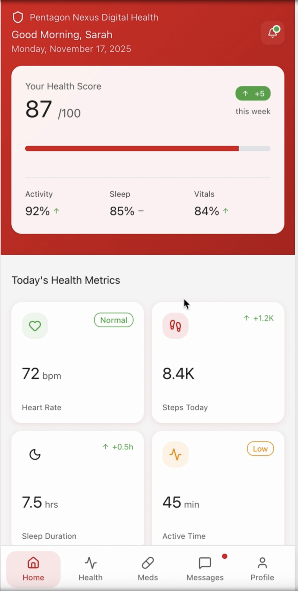
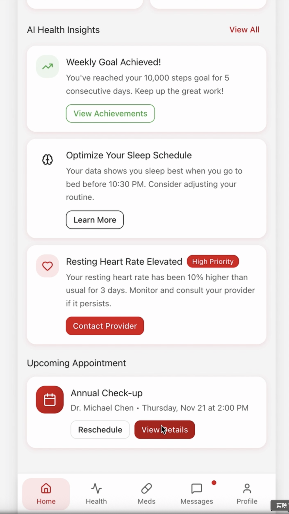
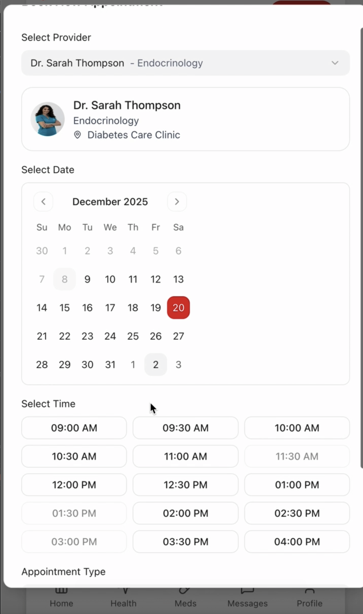
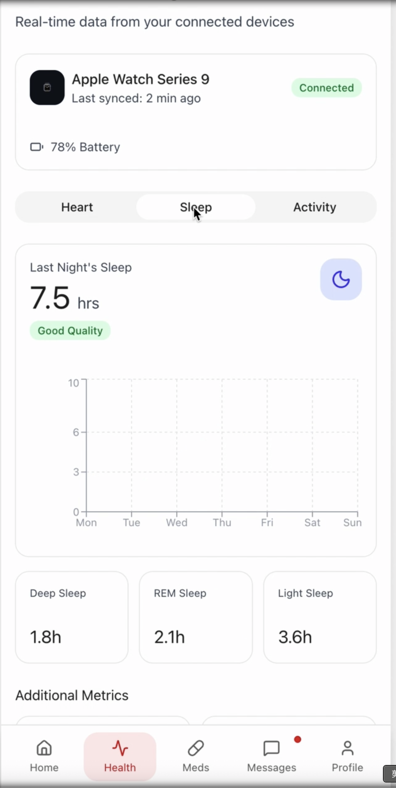
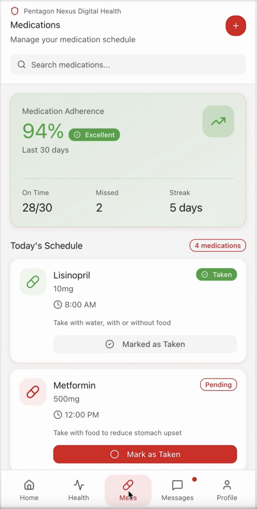
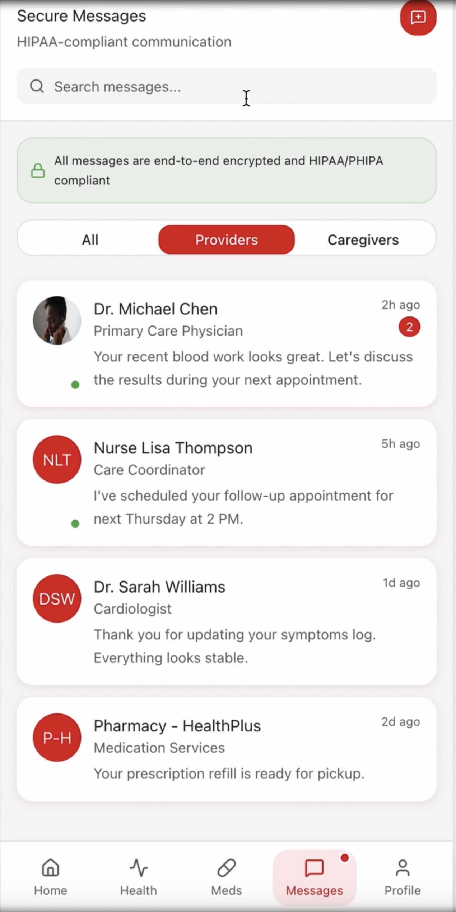
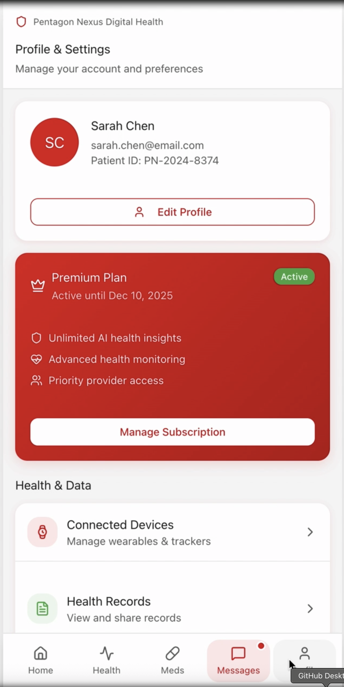

# Digital Health Companion – ITBA Capstone Project

This repository showcases my IT Business Analysis capstone project at Conestoga College: a **Digital Health Companion (DHC)** solution proposal for **CGI**.

The project simulates a real client engagement where our team acts as business analysts and solution designers. We analyze the current state, define business requirements, evaluate solution options, design the database and architecture, and build a roadmap for implementation.

---

## Award and Recognition

**First Position – Fall 2025 AGSIT Capstone Showcase**  
School of Applied Computer Science and Information Technology, Conestoga College

This award recognizes excellence in:
- Business analysis quality
- Solution design and evaluation
- Financial and strategic analysis
- Professional presentation and communication

---

## 1. Project Overview

- **Client:** CGI (simulated case)
- **Industry:** Digital Health / Healthcare Technology  
- **Role:** Project Manager / Business Analyst / Solution Designer  
- **Goal:** Design a consumer-facing **Digital Health Companion app** that helps users manage medications, vitals, and appointments, while enabling CGI to expand into the B2B2C digital health market.

**Key questions addressed:**

- How can CGI reduce dependency on government contracts and enter the private digital health market?
- What business requirements and KPIs define success for this initiative?
- Which solution option (build, partner, do-nothing) creates the strongest ROI over 5–20 years?
- How should data, integrations (FHIR/HL7), and security be designed?

---

## 2. Main Deliverables

All detailed documents are in the [`docs/`](./docs) folder.

- **Project Overview & Context**  
  High-level description of the problem, stakeholders, scope, and constraints.

- **Business Requirements**  
  - High-level business requirements  
  - Success metrics, assumptions, dependencies  
  - Business risks and mitigations

- **Solution Design & Evaluation**  
  - Comparison of solution options (e.g., build vs partner vs do nothing)  
  - Evaluation criteria and scoring  
  - Recommended option and rationale

- **Database & Data Model**  
  - ERD for key entities (User, Device, Medication_Reminder, Vital_Record, etc.)  
  - Data elements and relationships  
  - Data governance considerations

- **ROI & Financial Analysis**  
  - 5-year and 20-year ROI comparison  
  - Option 1 vs Option 2 vs Do Nothing  
  - Payback period, NPV-style thinking, and key financial assumptions

- **Risk Log**  
  - Project-specific risks (privacy, adoption, integration, compliance)  
  - Probability × Impact assessment  
  - Mitigation strategies

- **Test Strategy & Plan**  
  - Test objectives, scope, and approach  
  - Test types (functional, integration, UAT, security, performance)  
  - High-level test plan and sample test cases

- **Implementation & Transition Strategy**  
  - Phased rollout (Stage 1–3) with user numbers and scope  
  - Change management, training, and support model  
  - Transition requirements between my team and CGI operations

---

## 3. Visuals & Artifacts

Screenshots are in the [`figs/`](./figs) folder:

- `as_is_process.png` – current state process flow  
- `to_be_process.png` – future state process flow with DHC app  
- `database_erd.png` – database entity-relationship diagram  
- `app_prototype_screens.png` – mobile UI prototype preview  
- `poster_preview.png` – 48x36 capstone poster snapshot  

---

## Prototype Demo Video
Prototype link is in [`[prototype/figma_link.txt](https://pixel-motion-71650822.figma.site)`](.[/prototype/figma_link.txt](https://pixel-motion-71650822.figma.site)).

A short demo video demonstrating key user flows and the To-Be process is available here:

- [Watch the prototype demo video](https://github.com/julie92208/cgi-digital-health-companion-capstone/issues/2)

## Application Demo (Screenshots)

Below is a guided walkthrough of the Digital Health Companion prototype, demonstrating key user flows and core functionalities.

### 1. Secure Login
User authentication with password and biometric sign-in to ensure HIPAA/PHIPA-compliant access.

### 2. Health Dashboard
A personalized dashboard showing overall health score, activity, sleep, and vitals at a glance.

### 3. AI Health Insights
AI-generated insights highlighting achievements, recommendations, and high-priority alerts.

### 4. Appointment Scheduling
Users can select providers, dates, and available time slots directly within the app.

### 5. Connected Devices
Real-time health data synchronized from wearable devices such as Apple Watch.

### 6. Medication Management
Medication adherence tracking with reminders, status updates, and adherence analytics.

### 7. Secure Messaging
HIPAA/PHIPA-compliant messaging between patients, providers, and caregivers.

### 8. Subscription Management
Users can manage their personal profile, connected devices, data preferences, and premium subscription features within a single settings view.

---

## 4. My Role & Skills Demonstrated

In this project, I focused on:

- **Business Analysis**
  - Eliciting and structuring business requirements  
  - Defining success metrics, risks, assumptions, and dependencies  

- **Solution & Data Design**
  - Evaluating solution options and recommending a target architecture  
  - Designing the high-level data model and database ERD  

- **Financial & Strategic Thinking**
  - Building ROI models and comparing 5-year vs 20-year outcomes  
  - Translating strategy and financial results into clear visuals and slides  

- **Communication**
  - Creating a 30-minute client presentation and a poster  
  - Presenting complex ideas in a clear, visual, and engaging way  

---

## 5. How to Navigate This Repo

- 📁 [`docs/`](./docs) – Final reports (PDF/Word)  
- 📁 [`slides/`](./slides) – Final presentation and poster  
- 📁 [`figs/`](./figs) – Screenshots and diagrams  
- 📁 [`prototype/`](./prototype) – Figma link  
- 📁 [`data_samples/`](./data_samples) – Sample requirements and test cases  

---

## 6. Contact

If you’d like to discuss this project or my work as a Business/Data Analyst:

- **Name:** Julie  
- **Location:** Kitchener, ON, Canada  
- **Portfolio:** (add your GitHub Pages or portfolio URL here)  
- **LinkedIn:** (add your LinkedIn here)

